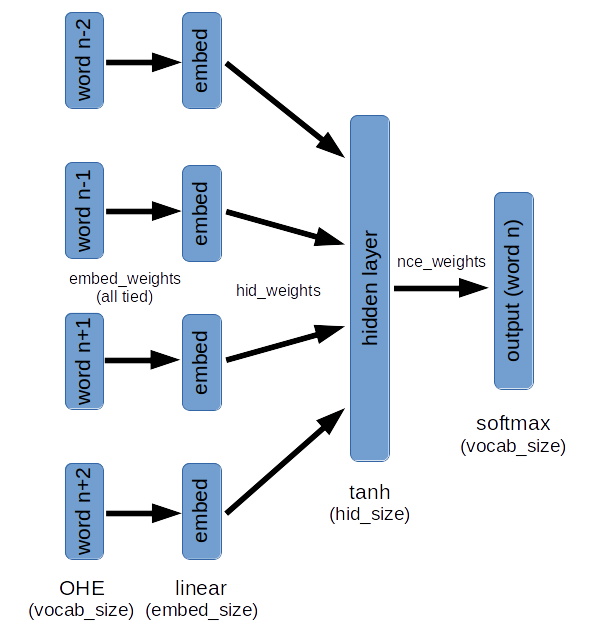
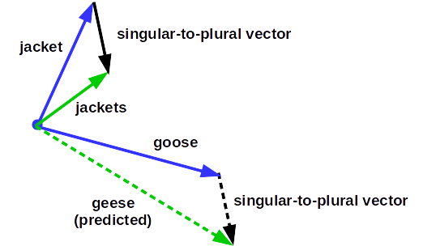

# Overview

My primary objective with this project was to learn [TensorFlow](https://www.tensorflow.org/). I've used [Keras](https://keras.io/) with TensorFlow as the back-end. Recently, I bumped into a situation where I struggled to make Keras build the neural net I wanted. So it was time to learn TensorFlow. Like most things, you learn by doing.

I chose to build a simple word-embedding neural net. This seemed a good compromise that was both interesting, but not so complex that I would be simulataneously debugging my neural net and TensorFlow.

# Word Vectors

A word vector is just a n-dimensional real-valued vector for each word in some dictionary (e.g. English). Word vectors for 2 similar words should be close to each other using some distance metric. For instance, you would expect "jacket" and "coat" to be close to each other. Similarly, you would expect "jacket" and "jackets" to be close.

But "jacket" is singular and "jackets" is plural, so there should be some difference in the vectors. Fine, the word with an "s" at the end is plural. But, what about "mouse" and "mice" or "goose" and "geese"? Who wants to teach a computer all of the bizarre rules of English. And then repeat the task for Spanish, German, French and on. Can we learn word vectors without human-labeled data?

# Unsupervised Learning

Learning word vectors from documents is a nice way to see the power of unsupervised learning. It can be counter-intuitive that a machine can learn much useful without human-labeled data. At first, I associated unsupervised learning with k-means clustering, and not much else. While clustering is useful, it hardly seems exciting. But unsupervised learning is exciting.

The *Big Idea* is to learn the structure in your data *before* using your precious hand-labeled examples. Consider these two very different approaches:

1. Hire a bunch of people to label thousands of words in dozens of documents. Then set your learning algorithm loose and hope it will learn features that generalize. But, because of time contraints, your training set never encounters "Angela Merkel". Maybe the algorithm sees capital letters and figures out she is a person. But, probably not much else.
2. Train a model on **hundreds** of documents and **millions** words. Learn patterns of words that seem interchangeable. Patterns of words that occur together. And so on. After this training, introduce a much smaller set of human-labeled data. When you label one word, the model will already know its similarity and relationship to dozens of other words. For example, if you label "Angela Merkel" as "head of state" and "Germany", the model will figure out that Francois Hollande is also a head of state. And, furthermore, that he is head of state of of France (having never been explicity told).

I hope this gives you some appreciation for the power of adding an unsupervised step to a machine learning problem. This same approach applies to many domains, including speech and image recognition.

# Learning Word Vectors

There are many approaches to learning vector representations of words. The approach used here is to train a model predict the "middle" word given the N preceding and N following words. Here is a diagram of the model:

Here are a some key points:

* The weights from the input One-Hot-Encoding (OHE) to the embedding layer are all "tied" together. This means the same weight vector is used for input word(n-2) as word(n-1), and so forth. This forces the model to learn the same representation of an input word, regardless of its input position.
* A softmax with the width of the entire vocabulary is not practical. [Noise Contrastive Estimation](https://www.cs.toronto.edu/~amnih/papers/wordreps.pdf) is used. Briefly, the target word and N-1 random words (drawn from a distribution roughly matching word frequencies) are used to calculate cross-entropy loss on each training example. This allows training to be done with a much smaller N-way softmax (I've used N=64).
* There are 2 places in the model to grab learned word vectors from:
	1. The usual embedding weights: from input OHE to embedding layer
	2. The weights from the hidden layer to the softmax layer. It turns out, word vectors from here gave qualitatively more sensible results.

# Results

I training the model using 3 Sherlock Holmes books (written by Sir Arthur Conan Doyle):

* The Hound of the Baskervilles
* The Sign of the Four
* The Adventures of Sherlock Holmes

Thanks to [Project Gutenberg](https://www.gutenberg.org/).

The total vocabulary size of these three books is 11,750 words. The total number of words is ~245,000. The model was trained using stochastic gradient descent (SGD) with momentum. I got better results using SGD with momentum than with either RMSProp or Adam optimizers ([here is a nice blog entry on various optimization algorithms](http://sebastianruder.com/optimizing-gradient-descent/)). The batch size was 32, with a learning rate of 0.01 and momentum of 0.9.

I constrained the word vectors to a dimension of 64. Word vectors with a dimension of 128 had lower training and validation loss. Forcing the model to learn a more economical (lower dimensionality) representation leads to more interesting (and perhaps more useful) results.

#### Word Similarity

Here I plug in a word and find the 8 closest words based on cosine similarity to the learned word vectors.

**"seven" : ['eight', 'five', 'ten', 'eleven', 'twelve', 'six', 'four', 'nine']**
**"laughing" : ['smiling', 'rising', 'chuckling', "'and", 'wild', 'pensively', "'well", 'yawning']**
**"mr" : ['mrs', 'dr', "'mr", 'blind', 'earnestly', 'l', 'servant', 'st']**

I think the above results to be amazing. At the beginning of training, this model had no idea seven, five or ten were all numbers - they were just a random jumble of letter. The computer had never "read a book" in its life. And, now it has read only 3 Sherlock Holmes books and figured out these relationships.

#### Analogies

This diagram illustrates the approach to predicting analogies using word vectors:

The possibilities here are exciting. Again, we are using a model trained with no human-labeled examples. With a properly trained model, you can query: "Massachusetts" to "Boston" : "Colorado" to "?". You can reasonably expect to get "Denver" as the result (although not with the Sherlock Holmes training set).

Here are some actual results from the *Sherlock Holmes* training.

**had to has : was to** ['was', **'is'**, 'has', **'lives'**, 'makes']
**boot to boots : arm to** ['boots', **'arms'**, 'weeks', **'limbs'**, 'heart']

Not perfect, but the answers in the top-5 are certainly encouraging.

# The Code

The project has 2 major components:

* 3 Python modules to:
	1. Load and process text documents (docload.py)
	2. Build and train TensorFlow model (windomodel.py)
	3. Explore the learned word vectors (wordvector.py)
* iPython Notebooks
	* Load text documents, train models and explore the results (sherlock.ipynb)
	* Hyper-parameter tuning and viewing learning curves (tune\_\*.ipynb)
	* Plot word frequencies (word\_frequency.ipynb)

I did my best to write clear code for the 3 Python modules. I hope others find them useful for their project, or for just better understanding how to use TensorFlow.

For additional details on the code please see [README.md](https://github.com/pat-coady/word2vec/blob/master/README.md) on the GitHub page.

